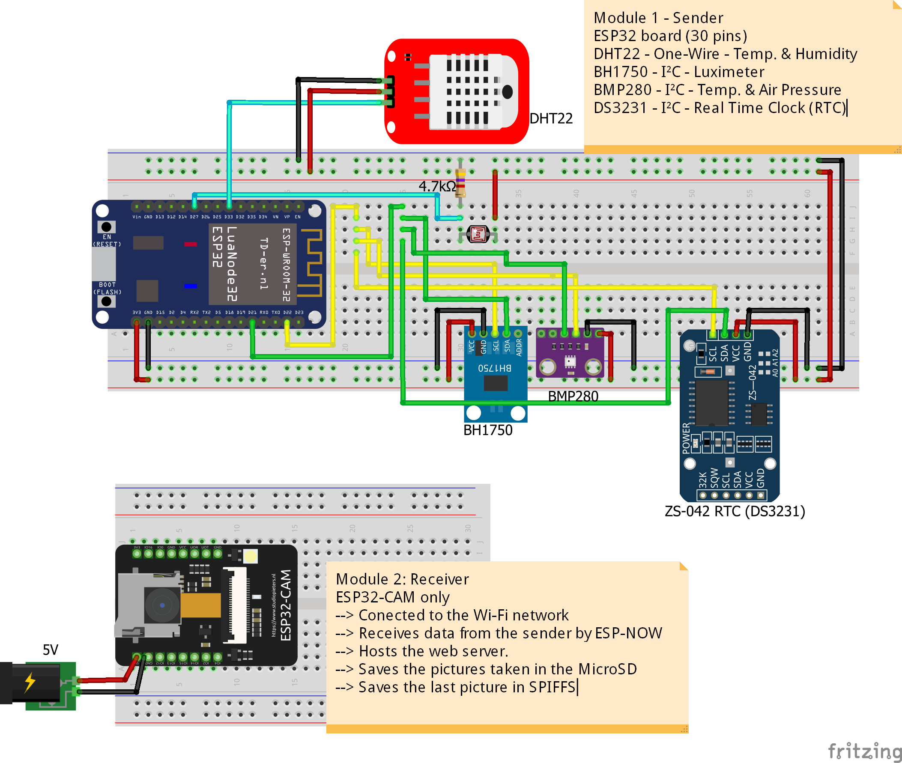

# ESP32 and ESP32-CAM: Web Server and **ESP-NOW** protocol           
 - This project is a modification of this project: https://github.com/dualvim/WebServer_ESP32CAM_Sensors_MQTT         
	- In the former project, an ESP8266 board read some sensors and an ESP32-CAM board receved these data via MQTT protocol.       
	- This project uses the **ESP-NOW protocol** to send data from one ESP32 board to another.     
	- This project uses two boards with ESP32 SoC:       
		- Module 1: NodeMCU with **ESP-WROOM-32**/**ESP-32S**         
		- Module 2: **ESP32-CAM**, which includes an OV2640 camera module and a MicroSD card module.      
	- The **NodeMCU ESP32** board is connected to some sensors - temperature, air pressure, humidity, light and Real Time Clock (RTC) - and it sends the values read in these sensors to an ESP32-CAM board.       
	- The **ESP32-CAM** board hosts a web server which shows the last picture taken by the camera (saved in the SPIFFS) and the values received from the first board.      
		- The Wi-Fi module in this board works on the **`WIFI_AP_STA`** mode which combines the modes **Station (`WIFI_STA`)** and **Soft Access Point (`WIFI_AP`)**.         
		- It creates an Soft Access Point, where the other ESP boards connects to.       
		- Also, it is connected to a Wi-Fi network with internet connection.       
	- With this configuration, the web server hosted in the board can be accessed by two different manners:       
		- 1 - Over a device (computer, cell phone etc.) connected on the same Wi-Fi network, by typing the IP address of the web server.        
		- 2 - By redirecting the IP address of the web server to the internet. Here, I use the services from **NGROK**.        
		

# 1 - References:        
 - This project was built over many ideas presented in many posts published by **Rui Santos** and **Sara Santos** in the **Random Nerd Tutorials** (https://randomnerdtutorials.com/) and in the book-course **"Learn ESP32 with Arduino IDE"**, written by the same authors.       
 - Many parts of the code written for the ESP32-CAM board where taken from this post: https://randomnerdtutorials.com/esp32-cam-take-photo-save-microsd-card/         
 - The (excellent) posts about the ESP-NOW protocol are:        
	- 1 - https://randomnerdtutorials.com/esp-now-esp32-arduino-ide/       
	- 2 - https://randomnerdtutorials.com/esp-now-two-way-communication-esp32/        
	 

# 2 - The ESP-NOW protocol        
 - The scripts here use the protocol ESP-NOW only with ESP32 boards. I tried these scripts with an ESP8266 but it didn't work.        
	- The ESP-NOW protocol **ALSO works with the ESP8266, but with other resources** (which I don't know yet).         
	- The ESP-NOW is used for data transference between two or more ESP boards, and, of course, is available only in Espressif (company which developed the ESP-NOW, the ESP8266 and the ESP32) devices.        
 - This project uses a **One-Way Connection** between the two ESP32 boards.      
	- The NodeMCU board reads the sensors and **SENDS** the data to the ESP32-CAM board.      
	- The ESP32-CAM board **RECEIVES** the data from the NodeMCU and publish the received data in the web server.       
 - The web server hosted in the ESP32-CAM is redirected to the internet using the services from NGROK (https://ngrok.com/).         
	 

# 3 - Parts used in this project:          
 - NodeMCU ESP32 board - x1       
 - ESP32-CAM board - x1       
 - ZS-042 RTC module (with the DS3231 RTC) - x1       
 - DHT22 sensor (temperature and humidity) - x1             
 - BMP280 sensor module (temperature and air pressure) - x1       
 - BH1750FVI light sensor module - x1       
 - Light Dependent Resistor (LDR) - x1       
 - FTDI programmer **FT232RL** or **CP2101** based (to send the sketch to the ESP32-CAM and/or use as power supply) - x1       
 - MicroSD card - x1      
            

# 4 - Sketches:          
        

# 4.1 - Sketches of the project:       
 - **`Script_01_Adjust_DS3231_Time`**: Its only function is to adjust the date and time in the RTC module.       
 - **`Script_02_ESP32_ESPNowSender`**: Sketch sent to the NodeMCU ESP32 (the **SENDER** in this project).       
 - **`Script_03_ESP32CAM_ESP-NOW_WebServer`**: Sketch sent to the ESP32-CAM (the **RECEIVER** in this project).       
         

# 4.2 - Using the ESP-NOW and the Wi-Fi in the ESP32:           
 - Changes in the **RECEIVER** sketch:           
	- 1 - Set the Wi-Fi mode to **AP+STA mode** (Soft Access Point and STAtion).      
	- 2 - Create a Soft Access Point.     
	- 3 - Connect to your Wi-Fi network.      
          
```         
void setup(){
	/* Code before the ESP-NOW initialization */
	
	// Set the Wi-Fi mode to AP+STA 
      WiFi.mode(WIFI_AP_STA);
	
	// Create the Soft Access Point
      Serial.print("Creating the soft-AP...");
	WiFi.softAP(<SSID AP>, <PASSWORD AP>, <CHANNNEL AP>, 1);
	
	// Connect to the Wi-Fi Network
      WiFi.begin(<YOUR SSID>, <YOUR PASSWORD>);
      
	
	/* Initialize the ESP-NOW and subsequent code in setup() */
}
```         
        

 - Changes in the **SENDER** sketch:           
	- 1 - Set the Wi-Fi mode to **STA mode** (Station).     
	- 2 - Connect to the Soft AP of the RECEIVER module, using the same procedure to connect to any other Wi-Fi network.         
	 
```        
void setup(){
	/* Code before the ESP-NOW initialization */
	
	// Set the Wi-Fi mode to STA 
      WiFi.mode(WIFI_STA);
	
	// Connect to the Soft Access Point
      WiFi.begin(<SSID AP>, <PASSWORD AP>);
      
	
	/* Initialize the ESP-NOW and subsequent code in setup() */
}
```        
	 

# 5 - Images:         
 - Link to access the Web Server on the internet: http://0.tcp.ngrok.io:11614/      
	- This address changes everytime the NGROK service is called.       
	- This address is only valid for 2020-02-03.        
 - Here is shown some important images of the project. More images are available in the folder **`Images`**.       
       

## 5.1 - Schematic diagram (built using Fritzing)        
           
         
 - More information about Fritzing in: https://fritzing.org/home/        
           


## 5.2 - Project in operation:         
           
         

## 5.3 - Screenshot        
            
         